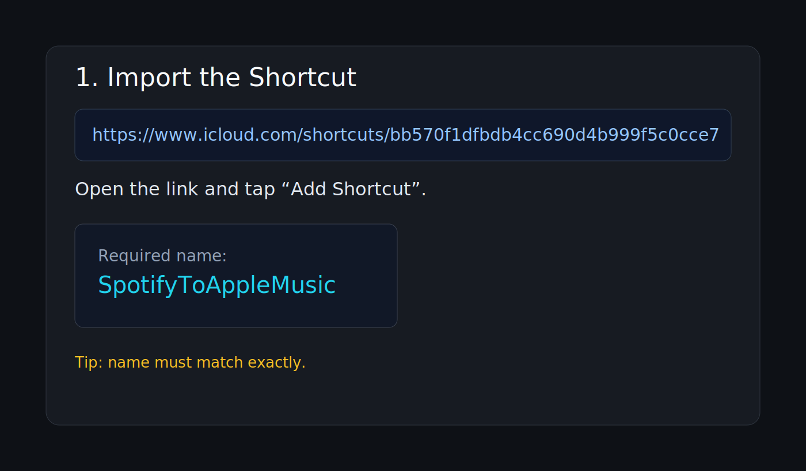
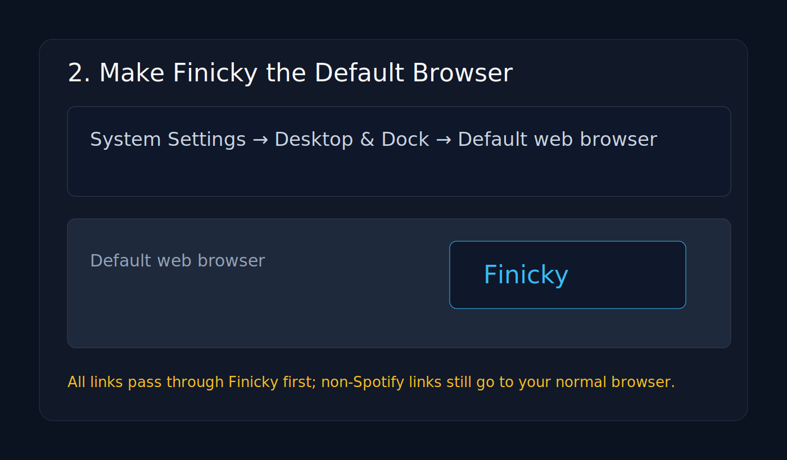
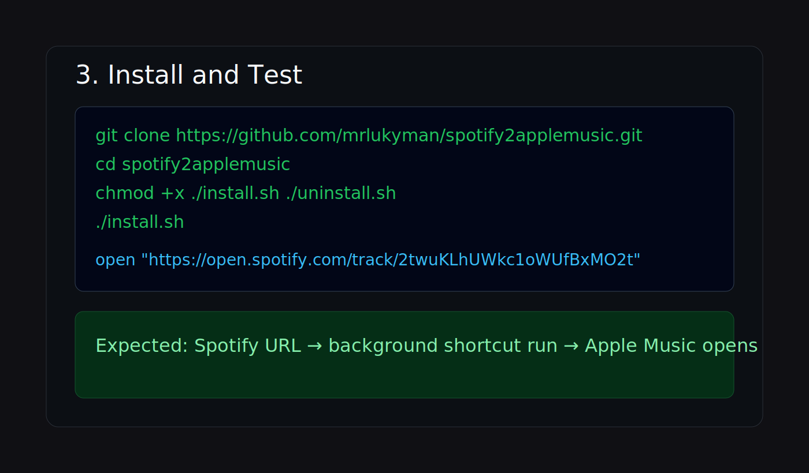

# Spotify -> Apple Music Redirect (macOS)

Open any Spotify link from any app, run a Shortcut in the background, convert to Apple Music, and launch Music.app.

## Demo setup flow

These screenshots are quick setup guides for the key steps.





## What this project installs

- Background runner app: `~/Applications/SpotifyShortcutRunner.app`
- Finicky config: `~/.finicky.js`

Finicky catches Spotify links and sends them to the runner app. The runner app calls **Shortcuts Events** so the Shortcut runs in the background.

## Requirements

- macOS
- [Finicky](https://github.com/johnste/finicky)
- A Shortcut named **`SpotifyToAppleMusic`**

Shortcut import link:
- [SpotifyToAppleMusic (iCloud)](https://www.icloud.com/shortcuts/bb570f1dfbdb4cc690d4b999f5c0cce7)

## 5-minute install

1. Import the shortcut from the iCloud link above.
2. Verify the shortcut name is exactly `SpotifyToAppleMusic`.
3. Clone this repo and run installer:

```bash
git clone https://github.com/mrlukyman/spotify2applemusic.git
cd spotify2applemusic
chmod +x ./install.sh ./uninstall.sh
./install.sh
```

4. Set macOS default browser to **Finicky**:
- `System Settings` -> `Desktop & Dock` -> `Default web browser` -> `Finicky`

5. Test:

```bash
open "https://open.spotify.com/track/2twuKLhUWkc1oWUfBxMO2t?si=test"
```

Expected behavior:
- Spotify URL is intercepted before Arc/Safari/etc.
- Shortcut runs in background.
- Apple Music opens to the converted item.

## Optional customization

Use a different shortcut name:

```bash
SHORTCUT_NAME="MySpotifyConverter" ./install.sh
```

Use a different fallback browser bundle ID:

```bash
DEFAULT_BROWSER_BUNDLE_ID="com.apple.Safari" ./install.sh
```

## Permissions (first run)

If prompted, allow Automation for runner app -> Shortcuts Events/Shortcuts.

If things fail silently, check:
- `System Settings` -> `Privacy & Security` -> `Automation`
- Ensure permissions are enabled for the runner app.

## Troubleshooting

Finicky opens normal browser for Spotify URLs:
- Make sure Finicky is your default browser.
- Restart Finicky after install.

Shortcut does not run:
- Confirm shortcut name is exactly `SpotifyToAppleMusic`.
- Test directly:

```bash
echo "https://open.spotify.com/track/2twuKLhUWkc1oWUfBxMO2t" > /tmp/spotify-test-url.txt
shortcuts run "SpotifyToAppleMusic" --input-path /tmp/spotify-test-url.txt
```

Music opens web instead of app:
- Make sure your shortcut opens `nativeAppUriDesktop` (or equivalent app URI), not plain web URL.

## Uninstall

```bash
./uninstall.sh
```

## License

MIT. See `LICENSE`.
